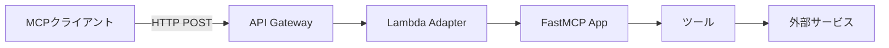
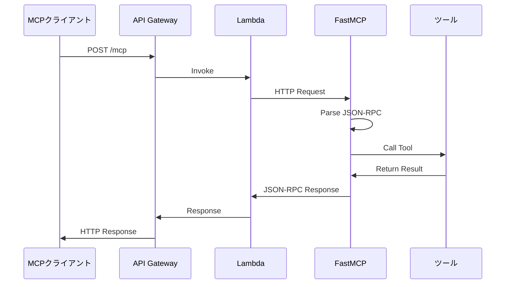

# アーキテクチャ

MCP サーバーの技術的なアーキテクチャと設計について説明します。

## システム概要



## コンポーネント

### 1. API Gateway

- **役割**: HTTP エンドポイントの提供
- **機能**:
  - リクエストのルーティング
  - CORS 設定
  - API Key 認証 (オプション)
  - スロットリング

### 2. Lambda Function

- **ランタイム**: Python 3.13
- **アーキテクチャ**: ARM64 (Graviton2)
- **メモリ**: 1024 MB
- **タイムアウト**: 30 秒

### 3. Lambda Adapter Layer

- **バージョン**: v18
- **機能**: HTTP 通信を Lambda イベントに変換
- **ARN**: `arn:aws:lambda:${AWS::Region}:753240598075:layer:LambdaAdapterLayerArm64:18`

### 4. FastMCP

- **役割**: MCP プロトコルの実装
- **機能**:
  - ツールの自動登録
  - JSON-RPC 2.0 処理
  - HTTP/SSE サポート

## ディレクトリ構造

```
mcp/
├── src/                      # ソースコード
│   ├── app/
│   │   ├── __main__.py      # アプリケーションエントリポイント
│   │   ├── main.py          # FastMCPインスタンス
│   │   └── tools/           # ツール定義
│   │       ├── __init__.py
│   │       ├── sample_tool.py
│   │       └── weather_forecast.py
│   ├── requirements.txt     # Python依存関係
│   └── run.sh              # Lambda起動スクリプト
├── template.yaml           # SAM テンプレート
├── samconfig.toml         # SAM 設定
├── mkdocs.yml            # MkDocs設定
└── docs/                 # ドキュメント
```

## データフロー

### リクエストの流れ



### ツール登録の流れ

```python
# 1. main.py でFastMCPインスタンス作成
mcp = FastMCP(stateless_http=True, json_response=True)

# 2. tools/ ディレクトリをスキャン
tools_dir = Path(__file__).parent / "tools"

# 3. 各モジュールをインポート
for _, module_name, _ in pkgutil.iter_modules([str(tools_dir)]):
    importlib.import_module(f"app.tools.{module_name}")
    # @mcp.tool() デコレータが実行され、ツールが自動登録される

# 4. HTTPアプリを生成
app = mcp.http_app()
```

## MCP Protocol

### JSON-RPC 2.0 フォーマット

MCP サーバーは JSON-RPC 2.0 プロトコルを使用します。

#### リクエスト

```json
{
  "jsonrpc": "2.0",
  "method": "tools/call",
  "params": {
    "name": "add",
    "arguments": {
      "a": 5,
      "b": 10
    }
  },
  "id": 1
}
```

#### レスポンス (成功)

```json
{
  "jsonrpc": "2.0",
  "result": {
    "content": [
      {
        "type": "text",
        "text": "15"
      }
    ]
  },
  "id": 1
}
```

#### レスポンス (エラー)

```json
{
  "jsonrpc": "2.0",
  "error": {
    "code": -32602,
    "message": "Invalid params"
  },
  "id": 1
}
```

### サポートされるメソッド

| メソッド     | 説明                           | パラメータ          |
| ------------ | ------------------------------ | ------------------- |
| `tools/list` | 利用可能なツールのリストを取得 | なし                |
| `tools/call` | ツールを実行                   | `name`, `arguments` |
| `initialize` | セッションを初期化             | クライアント情報    |

## デプロイメント

### CloudFormation スタック

```yaml
Resources:
  # API Gateway
  McpApi:
    Type: AWS::Serverless::Api
    Properties:
      StageName: Prod
      Cors: enabled

  # Lambda Function
  Function:
    Type: AWS::Serverless::Function
    Properties:
      Runtime: python3.13
      Architectures: [arm64]
      Layers:
        - Lambda Adapter Layer
      Environment:
        AWS_LAMBDA_EXEC_WRAPPER: /opt/bootstrap
        PORT: 8080
```

### ビルドプロセス

```bash
# 1. 依存関係をインストール
sam build

# 2. CloudFormationテンプレートを生成
# .aws-sam/build/ に出力

# 3. S3にアップロード + デプロイ
sam deploy
```

## パフォーマンス

### コールドスタート

- **初回起動**: 約 2-3 秒
- **ウォーム時**: 約 100-200ms

### 最適化

1. **ARM64 アーキテクチャ**: x86 より約 20%高速
2. **メモリサイズ**: 1024 MB で最適なバランス
3. **Lambda Adapter**: HTTP オーバーヘッドを最小化

### スケーリング

- **同時実行数**: デフォルトで最大 1000
- **オートスケール**: 負荷に応じて自動調整
- **予約済み同時実行数**: 必要に応じて設定可能

## セキュリティ

### IAM 権限

Lambda 実行ロールに必要な最小権限:

```yaml
Policies:
  - CloudWatchLogsFullAccess # ログ出力
  - AWSLambdaBasicExecutionRole # 基本実行権限
```

### API 認証

API Key を使用した認証の設定:

```yaml
McpApi:
  Type: AWS::Serverless::Api
  Properties:
    Auth:
      ApiKeyRequired: true
```

### CORS 設定

```yaml
Cors:
  AllowMethods: "'*'"
  AllowHeaders: "'*'"
  AllowOrigin: "'*'" # 本番では特定のオリジンに制限
```

## モニタリング

### CloudWatch Logs

ログは自動的に CloudWatch Logs に送信されます:

```
/aws/lambda/McpLambdaFunction
```

### メトリクス

重要なメトリクス:

- **Invocations**: 呼び出し回数
- **Duration**: 実行時間
- **Errors**: エラー数
- **Throttles**: スロットリング数

### X-Ray (オプション)

分散トレーシングの有効化:

```yaml
Function:
  Type: AWS::Serverless::Function
  Properties:
    Tracing: Active
```

## 拡張性

### 水平スケーリング

- Lambda は自動的にスケール
- 追加の設定不要

### 垂直スケーリング

メモリを増やして CPU 性能を向上:

```yaml
MemorySize: 2048 # 1024 から 2048 に変更
```

### マルチリージョン

複数のリージョンにデプロイ:

```bash
# 東京リージョン
sam deploy --region ap-northeast-1

# バージニアリージョン
sam deploy --region us-east-1
```

## 制限事項

### Lambda 制限

- **最大実行時間**: 15 分 (現在 30 秒に設定)
- **最大メモリ**: 10,240 MB (現在 1,024 MB)
- **ペイロードサイズ**: 6 MB (同期)、256 KB (非同期)

### API Gateway 制限

- **タイムアウト**: 29 秒
- **ペイロードサイズ**: 10 MB
- **リクエストレート**: アカウントごとに制限あり

## トラブルシューティング

### よくある問題

| 問題                 | 原因                 | 解決策                         |
| -------------------- | -------------------- | ------------------------------ |
| タイムアウト         | 処理時間が 30 秒超過 | `Timeout` を延長               |
| メモリ不足           | 大量データ処理       | `MemorySize` を増加            |
| コールドスタート遅延 | 初回起動             | Provisioned Concurrency を設定 |

## 次のステップ

- [カスタムツールの追加](custom-tools.md) - 新しいツールを作成
- [トラブルシューティング](../troubleshooting.md) - 問題解決
